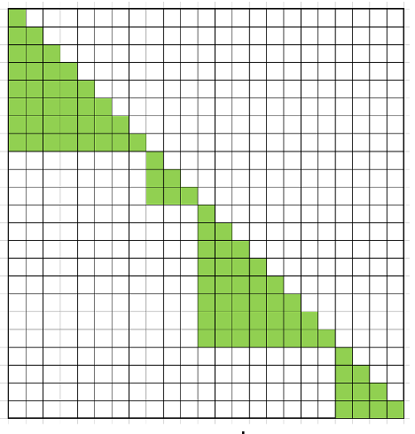
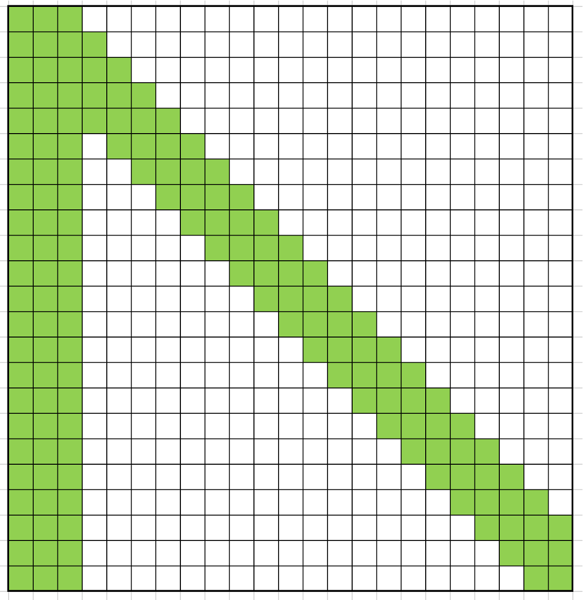
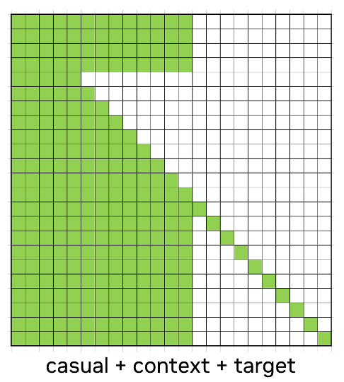

# Arbitrary Mask Usage

This document describes the arbitrary mask representation used by the FA4 CuTe
path and how to generate CSR block-sparse metadata with `create_block_mask_cuda`
in the current branch.

Arbitrary mask support lets each query token attend to any union of intervals in
the key sequence. The interval metadata lives in an `int32` Func Tensor, and the
CUDA helper in `csrc/utils/create_block_mask/` converts that tensor into compact
linear CSR metadata for block-sparse FA4 execution.

## Current Branch Quick Start

Install the FA4 Python package from the repository root:

```bash
pip install -e "flash_attn/cute[dev]"
```

Build and install the `create_block_mask_cuda` extension:

```bash
make create_block_mask
```

Equivalent lower-level commands:

```bash
make -C csrc/utils create_block_mask
cd csrc/utils/create_block_mask
pip install --no-user -e . --no-build-isolation
```

The build scripts intentionally install into the active/system Python install
path by default. Use an environment with write permission, such as a virtualenv
or a writable system install, before running the build.

Run the module-level tests:

```bash
make test_create_block_mask
```

Run the FA4 arbitrary-mask CSR integration tests. These tests use
`create_block_mask_cuda` to generate CSR metadata by default:

```bash
make test_arbitrary_mask_csr
# or
pytest tests/cute/test_arbitrary_mask_port.py -k "linear_block_sparse" -v
```

## Func Tensor Definition

The Func Tensor has shape:

```text
[mask_batch, mask_heads, n_func, seqlen_q + 256]
```

Requirements:

| Field | Requirement |
| --- | --- |
| `dtype` | `torch.int32` |
| device | CUDA tensor |
| `mask_batch` | `1` for broadcast, or the input batch size |
| `mask_heads` | `1` for broadcast, or the number of query heads |
| `n_func` | odd number |
| last dimension | at least `seqlen_q + 256` |

For each query position `q_idx`, the values encode a union of valid key
intervals:

```text
[0, F0) union [F1, F2) union [F3, F4) ...
```

That means `n_func = 2 * num_intervals - 1`. Use `F0 = 0` when the base
interval is empty. Keep interval endpoints clamped to `[0, seqlen_k]`.

## Mask Examples

### Causal

Each query at position `i` attends to keys `[0, i + 1)`.

```python
import torch

def causal_func(seqlen_q, seqlen_k, device="cuda"):
    func = torch.zeros(1, 1, 1, seqlen_q + 256, dtype=torch.int32, device=device)
    for i in range(seqlen_q):
        func[:, :, 0, i] = min(i + 1, seqlen_k)
    return func
```

### Variable Length as Fixed Length

Multiple packed sequences can be represented as one fixed-length sequence by
masking out cross-sequence attention.



```python
import torch

def packed_causal_func(cu_seqlens_qk, device="cuda"):
    total_seqlen = int(cu_seqlens_qk[-1])
    func = torch.zeros(1, 1, 3, total_seqlen + 256, dtype=torch.int32, device=device)

    for b in range(len(cu_seqlens_qk) - 1):
        seq_start = int(cu_seqlens_qk[b])
        seq_end = int(cu_seqlens_qk[b + 1])
        for s in range(seq_end - seq_start):
            q_idx = seq_start + s
            # [0, 0) union [seq_start, q_idx + 1)
            func[0, 0, 0, q_idx] = 0
            func[0, 0, 1, q_idx] = seq_start
            func[0, 0, 2, q_idx] = q_idx + 1

    return func
```

### Sink + Local Window

This pattern keeps a global sink prefix plus a causal local window.



```python
import torch

def sink_local_func(seqlen_q, seqlen_k, sink_width, window_left, device="cuda"):
    func = torch.zeros(1, 1, 3, seqlen_q + 256, dtype=torch.int32, device=device)
    for q_idx in range(seqlen_q):
        sink = min(sink_width, seqlen_k)
        local_start = max(0, q_idx - window_left)
        local_end = min(seqlen_k, q_idx + 1)

        if local_start <= sink:
            # The sink and local regions overlap, so one interval is enough.
            func[:, :, 0, q_idx] = max(sink, local_end)
        else:
            # [0, sink) union [local_start, local_end)
            func[:, :, 0, q_idx] = sink
            func[:, :, 1, q_idx] = local_start
            func[:, :, 2, q_idx] = local_end

    return func
```

### HSTU Context + Causal + Target

For recommendation-style sequences, context tokens can use full attention,
causal tokens can attend to context and previous causal tokens, and target tokens
can attend to context plus themselves.



```python
import torch

def hstu_func(q_context, q_causal, q_target, kv_context, device="cuda"):
    seqlen_q = q_context + q_causal + q_target
    func = torch.zeros(1, 1, 3, seqlen_q + 256, dtype=torch.int32, device=device)

    for c in range(q_context):
        func[:, :, 0, c] = kv_context

    for ca in range(q_causal):
        pos = q_context + ca
        func[:, :, 0, pos] = pos + 1

    for t in range(q_target):
        pos = q_context + q_causal + t
        # [0, kv_context) union [pos, pos + 1)
        func[:, :, 0, pos] = kv_context
        func[:, :, 1, pos] = pos
        func[:, :, 2, pos] = pos + 1

    return func
```

## CSR Block Sparsity

The Func Tensor gives element-level validity. CSR metadata gives block-level
sparsity so FA4 can skip key blocks that are fully masked.

`create_block_mask_cuda` creates two CSR structures:

| Direction | Extension function | FA4 argument |
| --- | --- | --- |
| Q2K, forward | `create_q2k_csr_sparse_from_func` | `linear_k_block_sparse_tensors` |
| K2Q, backward | `create_k2q_csr_sparse_from_func` | `linear_q_block_sparse_tensors` |

Both CSR functions return tensors in this order:

```text
(
    mask_block_cnt,
    mask_block_offset,
    mask_block_idx,
    full_block_cnt,
    full_block_offset,
    full_block_idx,
)
```

`LinearBlockSparseTensorsTorch.block_size` should be set to the `(Q_BLOCK_SIZE,
KV_BLOCK_SIZE)` used to build the CSR metadata. The block size must match the
effective tile size used by the FA4 kernel.

## Current Branch Calling Pattern

The integration test uses the explicit CSR APIs, which is the safest path when
you need exact control over FA4's effective block size.

```python
import torch

import create_block_mask_cuda
from flash_attn.cute import flash_attn_func
from flash_attn.cute.block_sparsity import LinearBlockSparseTensorsTorch


def linear_from_csr_tuple(csr_tensors, block_size):
    (
        mask_block_cnt,
        mask_block_offset,
        mask_block_idx,
        full_block_cnt,
        full_block_offset,
        full_block_idx,
    ) = csr_tensors
    return LinearBlockSparseTensorsTorch(
        mask_block_cnt=mask_block_cnt,
        mask_block_offset=mask_block_offset,
        mask_block_idx=mask_block_idx,
        full_block_cnt=full_block_cnt,
        full_block_offset=full_block_offset,
        full_block_idx=full_block_idx,
        block_size=block_size,
    )


def current_fa4_linear_block_sizes(head_dim, head_dim_v, seqlen_q, qhead_per_kvhead):
    """Matches tests/cute/test_arbitrary_mask_port.py for SM90/SM100 CSR tests."""
    major, _minor = torch.cuda.get_device_capability()

    if major == 9:
        # Current tests reuse the private FA4 SM90 tile selectors so the CSR
        # block size stays in lockstep with flash_attn/cute/interface.py.
        from flash_attn.cute.interface import _tile_size_bwd_sm90, _tile_size_fwd_sm90

        fwd_cfg = _tile_size_fwd_sm90(head_dim, head_dim_v, False, False)
        bwd_cfg = _tile_size_bwd_sm90(
            head_dim,
            head_dim_v,
            False,
            False,
            sparse_block_size_q=128,
        )
        return (fwd_cfg.m_block_size, fwd_cfg.n_block_size), (128, bwd_cfg.n_block_size)

    if major in (10, 11):
        q_stage = 2 if seqlen_q * qhead_per_kvhead > 128 else 1
        fwd_block_size = (q_stage * 128, 128)
        if head_dim == 192 and head_dim_v == 128:
            bwd_block_size = (256, 256)
        else:
            bwd_block_size = (256, 128)
        return fwd_block_size, bwd_block_size

    raise RuntimeError("arbitrary CSR path is supported by the current tests on SM90/SM100/SM110")


def make_linear_block_sparse_pair(arbitrary_func, seqlen_q, seqlen_k, fwd_block_size, bwd_block_size):
    q2k_csr = create_block_mask_cuda.create_q2k_csr_sparse_from_func(
        arbitrary_func,
        seqlen_q,
        seqlen_k,
        Q_BLOCK_SIZE=fwd_block_size[0],
        KV_BLOCK_SIZE=fwd_block_size[1],
        check_q_boundary=True,
    )
    k2q_csr = create_block_mask_cuda.create_k2q_csr_sparse_from_func(
        arbitrary_func,
        seqlen_q,
        seqlen_k,
        Q_BLOCK_SIZE=bwd_block_size[0],
        KV_BLOCK_SIZE=bwd_block_size[1],
    )
    return (
        linear_from_csr_tuple(q2k_csr, fwd_block_size),
        linear_from_csr_tuple(k2q_csr, bwd_block_size),
    )
```

A complete fixed-length call, assuming `sink_local_func`,
`current_fa4_linear_block_sizes`, and `make_linear_block_sparse_pair` from the
snippets above are already defined:

```python
import torch

batch, seqlen_q, seqlen_k = 2, 384, 384
nheads, nheads_kv = 4, 2
head_dim, head_dim_v = 256, 256
dtype = torch.bfloat16
device = "cuda"

q = torch.randn(batch, seqlen_q, nheads, head_dim, device=device, dtype=dtype, requires_grad=True)
k = torch.randn(batch, seqlen_k, nheads_kv, head_dim, device=device, dtype=dtype, requires_grad=True)
v = torch.randn(batch, seqlen_k, nheads_kv, head_dim_v, device=device, dtype=dtype, requires_grad=True)

arbitrary_func = sink_local_func(
    seqlen_q,
    seqlen_k,
    sink_width=8,
    window_left=16,
    device=device,
)

fwd_block_size, bwd_block_size = current_fa4_linear_block_sizes(
    head_dim,
    head_dim_v,
    seqlen_q,
    qhead_per_kvhead=nheads // nheads_kv,
)
linear_k, linear_q = make_linear_block_sparse_pair(
    arbitrary_func,
    seqlen_q,
    seqlen_k,
    fwd_block_size,
    bwd_block_size,
)

out, lse = flash_attn_func(
    q,
    k,
    v,
    arbitrary=True,
    aux_tensors=[arbitrary_func],
    linear_k_block_sparse_tensors=linear_k,
    linear_q_block_sparse_tensors=linear_q,
    return_lse=True,
)

out.sum().backward()
```

For forward-only inference, `linear_q_block_sparse_tensors` is not required.
For training, pass both Q2K and K2Q CSR metadata.

## Auto Helper APIs

The extension also exposes helper functions:

```text
create_block_mask_cuda.get_gpu_arch()
create_block_mask_cuda.get_fwd_tile_sizes(headdim, is_causal=False, is_local=False, is_arbitrary=True)
create_block_mask_cuda.get_bwd_tile_sizes(headdim, is_causal=False, is_local=False, is_arbitrary=True)
create_block_mask_cuda.create_q2k_csr_sparse_auto(...)
create_block_mask_cuda.create_k2q_csr_sparse_auto(...)
```

The `*_csr_sparse_auto` functions return the six CSR tensors followed by the
selected `(Q_BLOCK_SIZE, KV_BLOCK_SIZE)`:

```python
q2k_auto = create_block_mask_cuda.create_q2k_csr_sparse_auto(
    arbitrary_func,
    seqlen_q,
    seqlen_k,
    head_dim,
    is_causal=False,
    is_local=False,
    is_arbitrary=True,
    check_q_boundary=True,
)
q2k_csr, fwd_block_size = q2k_auto[:6], tuple(q2k_auto[6:8])
linear_k = linear_from_csr_tuple(q2k_csr, fwd_block_size)
```

Use the explicit path above when you need to match the exact current FA4 test
configuration, especially for SM100 cases where the effective forward Q block
can include `q_stage`.

## Implementation Support Matrix

This section covers `arbitrary=True` together with linear CSR block-sparse
metadata. Plain arbitrary masking without CSR has a broader path in some cases,
but it does not skip masked-out blocks.

Legend:

| Term | Meaning |
| --- | --- |
| supported | Implemented and covered by a representative current test or launch path |
| forward only | Q2K CSR is supported, but K2Q CSR backward is not a supported current target |
| compile-time | Available only if the C++ backend was built with the matching flags |
| not supported | Rejected by validation or not wired in the current path |

### CuTeDSL FA4 (`flash_attn/cute`)

| Architecture | Head dimensions | Attention mode | Forward Q2K CSR | Backward K2Q CSR | Notes |
| --- | --- | --- | --- | --- | --- |
| SM90 | `head_dim/head_dim_v` in the SM90 valid range, current CSR target `192/192` | MHA | supported | supported | Uses the generic SM90 block-sparse path. CSR block sizes must match `_tile_size_fwd_sm90` / `_tile_size_bwd_sm90`. |
| SM90 | current CSR target `192/192` | GQA/MQA | supported | forward only | Current CSR tests intentionally skip backward for SM90 `192/192` GQA/MQA. Treat K2Q CSR backward as unsupported until it is validated. |
| SM100/SM110 | standard aligned dimensions `<=128/<=128` | MHA/GQA/MQA | supported | supported | Generic SM100 block-sparse path. Use fixed-length linear CSR; do not combine with built-in causal/local/window or `mask_mod`. |
| SM100/SM110 | `192/128` | MHA/GQA/MQA | supported | supported with limits | Backward linear CSR uses the 2CTA path and expects K2Q `block_size=(256, 256)`. It does not support varlen/seqused tensors, `deterministic=True`, `softcap`, or `score_mod`. |
| SM100 | `256/256` | MHA | supported | supported with limits | Dedicated hd256 path. Forward CSR uses `block_size=(q_stage * 128, 128)`; backward K2Q CSR uses `block_size=(256, 128)`. Fixed-length only. |
| SM100 | `256/256` | GQA/MQA | supported | supported with limits | Same hd256 limits as MHA. For GQA/MQA backward, `linear_q_block_sparse_tensors` must be head-broadcast (`shape[1] == 1`). |
| SM100/SM110 | MLA `qv` path | MLA | not supported | not supported | `flash_attn_func(..., qv=..., arbitrary=True)` raises `NotImplementedError`. |
| SM80/SM120 | any | MHA/GQA/MQA/MLA | not supported | not supported | CuTeDSL arbitrary masking is currently restricted to SM90/SM100/SM110. |

Common CuTeDSL CSR restrictions:

- Linear CSR metadata is only accepted with `arbitrary=True`.
- Linear CSR cannot be combined with built-in causal/local/window masks or a
  user `mask_mod`; encode the desired pattern in the Func Tensor instead.
- `aux_tensors[0]` must be the Func Tensor and `n_func` must be odd.
- Backward block sparsity is fixed-length in the current CSR paths; varlen
  arbitrary masking without CSR has separate coverage.
- SM100 hd256 backward dQ CSR also uses the forward Q2K CSR. Its forward CSR Q
  block must be `256` rows unless the sequence has only one 128-row tile.

### Cutlass C++ Backend (`hopper/`)

The `hopper/` backend is a compile-time generated C++ path. It has separate
template instantiations for arbitrary Func Tensor sizes, architectures, dtypes,
and head dimensions.

| Architecture | Build requirements | Head dimensions | Attention mode | Forward Q2K CSR | Backward K2Q CSR | Notes |
| --- | --- | --- | --- | --- | --- | --- |
| SM80/SM86/SM89 | `SM8X=1 ARBITRARY=1 NUM_FUNC=<n_func>` | enabled `HDIM64/96/128/192/256` | MHA/GQA/MQA | compile-time | compile-time if `BACKWARD=1` | Runtime `arbitrary_func.shape[2]` must match one of the compiled `NUM_FUNC` values. |
| SM90 | `SM90=1 ARBITRARY=1 NUM_FUNC=<n_func>` | enabled `HDIM64/96/128/192/256` | MHA/GQA/MQA | compile-time | compile-time if `BACKWARD=1` | Forward arbitrary templates disable the PackGQA optimization internally, but semantic GQA/MQA is still routed by `num_heads / num_heads_k`. |
| SM90 | `SM90=1 ARBITRARY=1 NUM_FUNC=<n_func>` | forward-only diff-V builds: `HDIMDIFF64`, `HDIMDIFF192` | MHA/GQA/MQA | compile-time | use matching rounded backward HDIM only after validation | Diff-V forward instantiations include shapes such as `64/256`, `64/512`, and `192/128` when those flags are enabled. |
| SM90 | `SM90=1`, fp16/bf16, `head_dim <= 64`, `head_dim_v >= 256` | MLA `q_v` | compile-time forward path | no backward `q_v` API | The C++ forward template has a Hopper `q_v` path. It is not the CuTeDSL Blackwell MLA path, and it is not wired for backward. |
| SM100/SM110 | any | any | any | not supported | not supported | The C++ `hopper/` backend targets SM8x/SM90. Use CuTeDSL for Blackwell. |

C++ CSR notes:

- Build with `ARBITRARY=1` and include every required odd `n_func` in
  `NUM_FUNC`; otherwise runtime dispatch asks you to recompile with the missing
  `FLASH_ATTENTION_NUM_FUNC` value.
- Enable the head dimensions you need with `HDIM64/96/128/192/256`; defaults
  only enable `HDIM128`.
- Use explicit CSR block sizes that match `hopper/tile_size.h`. The
  `create_block_mask_cuda.get_*_tile_sizes` and `*_csr_sparse_auto` helpers in
  this branch mirror the CuTe FA4 Python tile selection, not the C++ `hopper/`
  tile table.
- Forward expects Q2K CSR tensors indexed by Q blocks. Backward expects K2Q CSR
  tensors indexed by KV blocks.

## API Notes

`flash_attn.cute.flash_attn_func` takes arbitrary-mask inputs through these
arguments:

```text
flash_attn_func(
    q,
    k,
    v,
    causal=False,
    arbitrary=True,
    aux_tensors=[arbitrary_func],
    linear_k_block_sparse_tensors=linear_k,
    linear_q_block_sparse_tensors=linear_q,
    return_lse=True,
)
```

Current constraints:

| Constraint | Notes |
| --- | --- |
| Architecture | arbitrary mask path is implemented for SM90/SM100/SM110 |
| `mask_mod` | cannot be combined with `arbitrary=True` |
| causal/local | do not combine CSR arbitrary path with built-in causal or window masks |
| Func Tensor | must be provided as `aux_tensors[0]` |
| `n_func` | must be odd |

## References

- `csrc/utils/create_block_mask/`: CUDA extension source and tests.
- `csrc/utils/create_block_mask/README.md`: focused build and tuple-order notes.
- `tests/cute/test_arbitrary_mask_port.py`: current branch integration tests.
- `flash_attn/cute/interface.py`: FA4 arbitrary-mask validation and tile selection.
